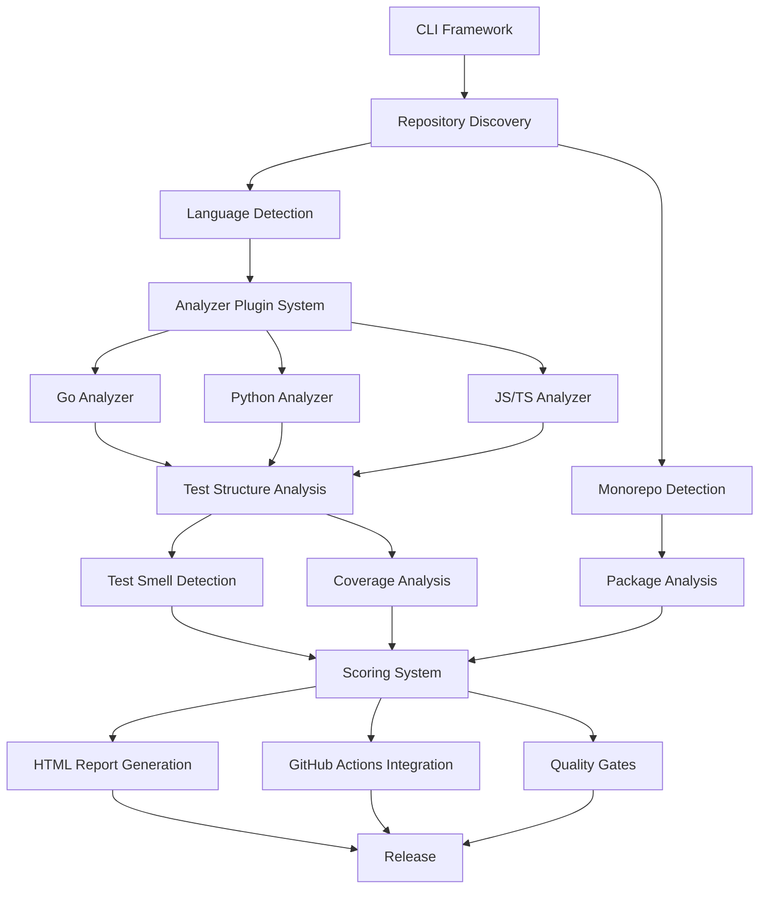

# Ship Shape - Implementation Roadmap v1.0.0

**Version**: 1.0.0
**Date**: 2026-01-27
**Status**: Ready for Execution
**Target Release**: v1.0.0 (24 weeks from start)

---

## Table of Contents

1. [Executive Summary](#executive-summary)
2. [Project Phases Overview](#project-phases-overview)
3. [Detailed Phase Breakdown](#detailed-phase-breakdown)
4. [Dependency Mapping](#dependency-mapping)
5. [Critical Path Analysis](#critical-path-analysis)
6. [Team Structure and Assignments](#team-structure-and-assignments)
7. [Risk Mitigation Strategy](#risk-mitigation-strategy)
8. [Quality Gates and Checkpoints](#quality-gates-and-checkpoints)
9. [Release Milestones](#release-milestones)
10. [Success Metrics](#success-metrics)

---

## Executive Summary

### Project Scope
Ship Shape v1.0.0 is a comprehensive testing quality and code analysis platform for multi-language repositories and monorepos. This roadmap provides a detailed 24-week implementation plan from foundation through production release.

### Key Deliverables
- Multi-language test analyzer (Go, Python, JavaScript/TypeScript, Java, Rust)
- Monorepo-native analysis with per-package scoring
- Test smell detection (11+ types)
- Coverage analysis with historical tracking
- Interactive HTML reports with visualizations
- GitHub Actions integration
- CLI and API interfaces
- **Meta-validation framework** (Ship Shape analyzes itself with ≥85/100 score)
- **Ground truth datasets** for accuracy validation (≥90% precision/recall)
- **Continuous validation infrastructure** (daily tests, weekly accuracy checks)

### Timeline Summary
- **Weeks 1-6**: Foundation + Technical Spike Validation
- **Weeks 7-12**: Core Analysis Engine + Language Analyzers
- **Weeks 13-18**: Advanced Features + Integration
- **Weeks 19-24**: Polish, Performance, Documentation + Release

### Team Requirements
- **Minimum**: 2-3 senior engineers
- **Optimal**: 4-5 engineers (enables parallel work streams)
- **Skills Required**: Go, Python, JavaScript/TypeScript, DevOps, Testing expertise

---

## Project Phases Overview

```
Phase 0: Foundation & Setup (Weeks 1-2)
├── Project infrastructure
├── Development environment
├── Core CLI framework
└── Repository discovery engine

Phase 1: Technical Spike Validation (Weeks 1-6)
├── SPIKE-001: AST Parsing Framework (Weeks 1-2)
├── SPIKE-002: Monorepo Analysis (Weeks 2-3)
├── SPIKE-003: Test Smell Detection (Weeks 3-4)
├── SPIKE-004: Coverage Parsing (Weeks 4-5)
├── SPIKE-005: GitHub Actions (Weeks 5-6)
├── SPIKE-006: HTML Reports (Weeks 6-7)
└── Ground Truth Dataset Foundation (SS-120)

Phase 2: Core Analysis Engine (Weeks 7-10)
├── Analyzer Plugin System
├── Language-specific analyzers (Go, Python, JS)
├── Test structure analysis
├── Integration tests
└── Continuous Validation Infrastructure (SS-124)

Phase 3: Coverage & Quality Analysis (Weeks 11-14)
├── Coverage report parsing
├── Test smell detection
├── Quality scoring system
├── Assessment framework
├── Accuracy Validation Framework (SS-121)
└── Dogfooding Framework (SS-122)

Phase 4: Advanced Features (Weeks 15-18)
├── Monorepo support
├── Tool adoption analysis
├── CI/CD workflow analysis
├── Historical trend tracking
├── Real-World OSS Validation (SS-123)
└── Comparison Validation with tsDetect (SS-125)

Phase 5: Reporting & Integration (Weeks 19-22)
├── HTML report generation
├── GitHub Actions integration
├── Quality gate enforcement
└── Pre-commit hooks

Phase 6: Production Readiness (Weeks 23-24)
├── Performance optimization
├── Documentation completion
├── Security audit
└── v1.0.0 Release
```

---

## Detailed Phase Breakdown

### Phase 0: Foundation & Setup (Weeks 1-2)

**Goal**: Establish project infrastructure and core framework

#### Week 1: Project Initialization
**Story Points**: 24

| Task | Story | Priority | Effort | Status | Dependencies |
|------|-------|----------|--------|--------|--------------|
| Initialize Go module and project structure | - | P0 | 2 SP | ✅ Done | None |
| Setup CI/CD (GitHub Actions) | - | P0 | 3 SP | ✅ Done | None |
| Create CLI framework with Cobra | - | P0 | 5 SP | ✅ Done | None |
| Implement configuration system | - | P0 | 5 SP | ✅ Done | CLI |
| Setup logging and error handling | - | P0 | 3 SP | ✅ Done | None |
| Create initial test infrastructure | - | P0 | 3 SP | ✅ Done | None |
| Begin ground truth dataset structure | SS-120 | P0 | 3 SP | ✅ Done | None |

**Deliverables**:
- ✅ Working CLI with `shipshape --version` and `shipshape --help`
- ✅ Configuration file loading (.shipshape.yml)
- ✅ Logging framework (structured logging with slog, --verbose/--quiet/--no-color flags, 96.4% coverage)
- ✅ CI/CD pipeline (build, test, lint, security, cross-compile)
- ✅ Test infrastructure (testutil package with helpers, version command tests, 82.1% overall coverage)
- ✅ Development documentation (CLAUDE.md with logging usage, CI/CD docs)
- ✅ Ground truth dataset structure (testdata/ with 26 directories, metadata schema, comprehensive READMEs)

#### Week 2: Repository Discovery Engine
**Story Points**: 21

| Task | Story | Priority | Effort | Dependencies |
|------|-------|----------|--------|--------------|
| Implement file system traversal | SS-001 | P0 | 3 SP | None |
| Language detection by extensions | SS-001 | P0 | 5 SP | Traversal |
| Parse dependency manifests | SS-002 | P0 | 5 SP | Traversal |
| Framework detection | SS-002 | P0 | 5 SP | Language det. |
| Repository context model | - | P0 | 3 SP | None |

**Deliverables**:
- ✅ Language detection with percentage distribution
- ✅ Framework identification (pytest, Jest, testing, etc.)
- ✅ Dependency manifest parsing (package.json, go.mod, etc.)
- ✅ Repository context object for downstream consumers
- ✅ Comprehensive test suite with fixtures

**Quality Gate** (Week 2):
- [ ] All tests passing
- [ ] >90% unit test coverage
- [ ] Build succeeds
- [ ] `shipshape discover` command functional

**Week 1 Progress**: 24/24 SP completed (100%) ✅

---

### Phase 1: Technical Spike Validation (Weeks 1-6)

**Goal**: Validate all high-risk technical approaches before full implementation

#### SPIKE-001: AST Parsing Framework (Weeks 1-2)

**Objective**: Validate multi-language AST parsing approach

**Tasks**:
1. **Week 1**: Go & Python Prototypes
   - Implement Go AST analyzer using `go/ast`
   - Implement Python analyzer with tree-sitter
   - Create benchmark test suites
   - Measure performance (100 files)

2. **Week 2**: JavaScript/TypeScript & Integration
   - Implement JS/TS analyzer with tree-sitter
   - Design unified analyzer interface
   - Create analyzer registry
   - Performance optimization

**Success Criteria**:
- ✅ Go: 100 files in <2s with >95% accuracy
- ✅ Python: 50 files in <5s with >90% accuracy
- ✅ JavaScript: 100 files in <10s with >95% accuracy
- ✅ Unified interface proven extensible

**Deliverables**:
- Working prototypes for 3 languages
- Unified `Analyzer` interface definition
- Performance benchmark report
- Go/No-Go decision document

**Risk**: tree-sitter accuracy for Python patterns
**Mitigation**: Fallback to subprocess if accuracy <85%

#### SPIKE-002: Monorepo Analysis Coordination (Weeks 2-3)

**Objective**: Validate monorepo detection and parallel processing

**Tasks**:
1. **Week 2**: Detection Algorithms
   - Implement npm/yarn/pnpm workspace detection
   - Implement Go workspace detection
   - Implement Lerna/Nx/Turborepo detection
   - Test on real monorepos

2. **Week 3**: Parallel Processing
   - Implement goroutine-based parallel executor
   - Package context isolation
   - Aggregate scoring algorithm
   - Benchmark with 20+ packages

**Success Criteria**:
- ✅ 5+ monorepo types detected with >95% accuracy
- ✅ 20 packages analyzed in <30s
- ✅ Memory usage <2GB for 20 packages
- ✅ Parallel processing >2x speedup

**Deliverables**:
- Monorepo detector for 5+ types
- Parallel coordinator with semaphore
- Aggregate scoring implementation
- Dependency graph builder

**Risk**: Memory exhaustion with many packages
**Mitigation**: Streaming results, configurable concurrency

#### SPIKE-003: Test Smell Detection (Weeks 3-4)

**Objective**: Validate pattern-based test smell detection

**Tasks**:
1. **Week 3**: Core Framework + Priority 1 Smells
   - Design detector interface and registry
   - Implement Mystery Guest detector
   - Implement Resource Optimism detector
   - Implement Assertion Roulette detector

2. **Week 4**: Additional Smells + Validation
   - Implement Conditional Logic detector
   - Implement Eager/Lazy Test detectors
   - Create remediation guidance database
   - Validate on real-world codebases

**Success Criteria**:
- ✅ 5+ smell types with >90% accuracy
- ✅ False positive rate <10%
- ✅ 100 files analyzed in <5s
- ✅ Remediation guidance complete

**Deliverables**:
- Test smell detector framework
- 5+ smell detectors (Priority 1)
- Language-specific pattern libraries
- Remediation guidance database (YAML)

**Risk**: High false positive rate
**Mitigation**: Confidence scoring, configurable thresholds

#### SPIKE-004: Coverage Report Parsing (Weeks 4-5)

**Objective**: Validate multi-format coverage parsing

**Tasks**:
1. **Week 4**: Core Parsers
   - Implement Cobertura XML parser
   - Implement LCOV parser
   - Implement Coverage.py JSON parser
   - Unified coverage data model

2. **Week 5**: Go Parser + GitHub Integration
   - Implement Go coverage profile parser
   - GitHub API integration (artifact download)
   - Coverage quality assessor
   - Historical trend tracking

**Success Criteria**:
- ✅ 4 formats parsed with >99% accuracy
- ✅ 10MB files parsed in <2s
- ✅ GitHub API integration functional
- ✅ Quality assessment algorithm validated

**Deliverables**:
- Parser framework with auto-detection
- 4 format-specific parsers
- GitHub API integration
- Coverage quality assessor

**Risk**: Large coverage files (>100MB)
**Mitigation**: Streaming parsers, memory limits

#### SPIKE-005: GitHub Actions Integration (Weeks 5-6)

**Objective**: Validate GitHub Actions integration

**Tasks**:
1. **Week 5**: Action Package + Workflow Analysis
   - Create action.yml and Dockerfile
   - Implement workflow YAML parser
   - CI optimization detector
   - Test in real repository

2. **Week 6**: API Integration + Quality Gates
   - GitHub Checks API integration
   - PR comment manager
   - Quality gate evaluator
   - Marketplace preparation

**Success Criteria**:
- ✅ Action runs successfully in test repos
- ✅ PR comments display correctly
- ✅ Checks API integration works
- ✅ Action overhead <10s

**Deliverables**:
- GitHub Action package (action.yml + Dockerfile)
- Workflow analyzer
- Checks API client
- PR comment manager

**Risk**: GitHub API rate limiting
**Mitigation**: Authenticated requests, caching

#### SPIKE-006: HTML Report Generation (Weeks 6-7)

**Objective**: Validate interactive HTML report generation

**Tasks**:
1. **Week 6**: Template System + Charts
   - Create HTML template structure
   - Integrate go-echarts for charts
   - Implement responsive CSS
   - Theme support (light/dark)

2. **Week 7**: Interactivity + Optimization
   - Table filtering and sorting
   - Code syntax highlighting
   - Accessibility validation
   - Performance optimization for large reports

**Success Criteria**:
- ✅ Charts render interactively
- ✅ Responsive on mobile devices
- ✅ Large reports (10,000 findings) <10s generation
- ✅ Accessibility score >90%

**Deliverables**:
- HTML template system
- Chart generation module (5 chart types)
- Responsive CSS with themes
- Interactive JavaScript features

**Risk**: Large HTML file sizes
**Mitigation**: Lazy loading, pagination

---

### Phase 2: Core Analysis Engine (Weeks 7-10)

**Goal**: Build production-ready analyzer framework and language-specific analyzers

#### Week 7: Analyzer Plugin System Implementation
**Story Points**: 34

**Based on**: SPIKE-001 outcomes

| Task | Story | Priority | Effort | Dependencies |
|------|-------|----------|--------|--------------|
| Implement core analyzer interfaces | - | P0 | 5 SP | SPIKE-001 |
| Build analyzer registry | - | P0 | 3 SP | Interfaces |
| Create plugin discovery mechanism | - | P0 | 5 SP | Registry |
| Implement lifecycle management | - | P0 | 3 SP | Registry |
| Write comprehensive tests | - | P0 | 5 SP | All above |
| **Setup continuous validation infrastructure** | **SS-124** | **P0** | **13 SP** | **Test infra** |

**Deliverables**:
- `internal/analyzer/interface.go` - Core interfaces
- `internal/analyzer/registry.go` - Thread-safe registry
- `internal/analyzer/lifecycle.go` - Initialization system
- Plugin discovery with `.so` loading support
- >90% test coverage

#### Week 8: Go Test Analyzer
**Story Points**: 13

**Based on**: SPIKE-001 Go prototype

| Task | Story | Priority | Effort | Dependencies |
|------|-------|----------|--------|--------------|
| Implement Go AST analyzer | SS-010 | P0 | 5 SP | Plugin system |
| Table-driven test detection | SS-010 | P0 | 3 SP | AST analyzer |
| Parallel test detection | SS-010 | P0 | 2 SP | AST analyzer |
| Subtest extraction | SS-010 | P0 | 3 SP | AST analyzer |

**Deliverables**:
- `internal/analyzer/goanalyzer/go_analyzer.go`
- Table-driven test detection (98%+ accuracy)
- `t.Parallel()` detection (100% accuracy)
- Subtest extraction via `t.Run` calls
- Comprehensive test suite

**Quality Gate**:
- [ ] 100 Go test files analyzed in <2s
- [ ] >95% pattern detection accuracy
- [ ] >90% test coverage
- [ ] All benchmark tests passing

#### Week 9: Python Test Analyzer
**Story Points**: 13

**Based on**: SPIKE-001 Python prototype

| Task | Story | Priority | Effort | Dependencies |
|------|-------|----------|--------|--------------|
| Implement tree-sitter Python analyzer | SS-011 | P0 | 5 SP | Plugin system |
| pytest fixture detection | SS-011 | P0 | 3 SP | Analyzer |
| Parametrized test detection | SS-011 | P0 | 3 SP | Analyzer |
| unittest framework support | SS-011 | P0 | 2 SP | Analyzer |

**Deliverables**:
- `internal/analyzer/pythonanalyzer/python_analyzer.go`
- pytest fixture detection with scopes
- `@pytest.mark.parametrize` detection
- unittest and pytest differentiation
- Comprehensive test suite

**Quality Gate**:
- [ ] 50 Python test files analyzed in <5s
- [ ] >90% pattern detection accuracy
- [ ] Works without Python runtime (tree-sitter)
- [ ] >90% test coverage

#### Week 10: JavaScript/TypeScript Test Analyzer
**Story Points**: 13

**Based on**: SPIKE-001 JS/TS prototype

| Task | Story | Priority | Effort | Dependencies |
|------|-------|----------|--------|--------------|
| Implement tree-sitter JS/TS analyzer | SS-012 | P0 | 5 SP | Plugin system |
| Test block detection (describe/it) | SS-012 | P0 | 3 SP | Analyzer |
| Hook detection (beforeEach, etc.) | SS-012 | P0 | 2 SP | Analyzer |
| Mock pattern detection | SS-012 | P0 | 3 SP | Analyzer |

**Deliverables**:
- `internal/analyzer/jsanalyzer/js_analyzer.go`
- Test block detection with nesting
- Hook detection (beforeEach, afterEach, etc.)
- Jest vs Vitest differentiation
- JSX/TSX support

**Quality Gate**:
- [ ] 100 JS/TS files analyzed in <10s
- [ ] >95% pattern detection accuracy
- [ ] Handles JSX/TSX correctly
- [ ] >90% test coverage

---

### Phase 3: Coverage & Quality Analysis (Weeks 11-14)

**Goal**: Implement coverage parsing, test smell detection, and quality scoring

#### Week 11: Coverage Report Parsing
**Story Points**: 13

**Based on**: SPIKE-004 outcomes

| Task | Story | Priority | Effort | Dependencies |
|------|-------|----------|--------|--------------|
| Implement coverage parser framework | SS-040 | P0 | 5 SP | SPIKE-004 |
| Cobertura XML parser | SS-040 | P0 | 3 SP | Framework |
| LCOV parser | SS-040 | P0 | 2 SP | Framework |
| Coverage.py JSON & Go profile parsers | SS-040 | P0 | 3 SP | Framework |

**Deliverables**:
- `internal/coverage/parser.go` - Unified interface
- `internal/coverage/parsers/` - Format-specific parsers
- Auto-detection algorithm
- Parser registry with 4 formats

**Quality Gate**:
- [ ] 4 formats with >99% parsing accuracy
- [ ] 10MB files parsed in <2s
- [ ] Memory usage <100MB per 10MB file

#### Week 12: Coverage Quality Assessment
**Story Points**: 8

**Based on**: SPIKE-004 outcomes

| Task | Story | Priority | Effort | Dependencies |
|------|-------|----------|--------|--------------|
| Implement coverage assessor | SS-041 | P0 | 3 SP | Parsers |
| Critical path detection | SS-041 | P0 | 3 SP | Assessor |
| GitHub API integration for trends | SS-041 | P0 | 2 SP | Assessor |

**Deliverables**:
- `internal/coverage/assessor.go`
- Critical path identification
- Coverage gap analysis
- GitHub artifact integration

**Quality Gate**:
- [ ] Accurately identifies uncovered critical paths
- [ ] GitHub API integration functional
- [ ] Historical trend tracking works

#### Week 13: Test Smell Detection Implementation
**Story Points**: 13

**Based on**: SPIKE-003 outcomes

| Task | Story | Priority | Effort | Dependencies |
|------|-------|----------|--------|--------------|
| Implement smell detector framework | SS-030 | P0 | 5 SP | SPIKE-003 |
| Priority 1 smell detectors (5 types) | SS-030 | P0 | 5 SP | Framework |
| Remediation guidance integration | SS-030 | P0 | 3 SP | Detectors |

**Deliverables**:
- `internal/smell/detector.go` - Interface
- `internal/smell/detectors/` - 11 smell types
- `data/remediations.yaml` - Guidance database
- Language-specific pattern libraries

**Quality Gate**:
- [ ] 11 smell types implemented
- [ ] >90% detection accuracy
- [ ] False positive rate <10%
- [ ] 100 files analyzed in <5s

#### Week 14: Scoring & Assessment System + Validation
**Story Points**: 34

| Task | Story | Priority | Effort | Dependencies |
|------|-------|----------|--------|--------------|
| Implement dimension-based scoring | SS-050 | P0 | 5 SP | All analyzers |
| Weighted scoring algorithm | SS-050 | P0 | 3 SP | Scoring |
| Grade assignment (A-F) | SS-050 | P0 | 2 SP | Scoring |
| Evidence-based thresholds | SS-050 | P0 | 3 SP | Research |
| **Implement accuracy validation framework** | **SS-121** | **P0** | **13 SP** | **Smells + Coverage** |
| **Setup dogfooding framework (self-analysis)** | **SS-122** | **P0** | **8 SP** | **Scoring** |

**Deliverables**:
- `internal/scoring/scorer.go`
- Multi-dimensional scoring (6 dimensions)
- Weighted aggregate calculation
- Grade assignment (A+, A, B, C, D, F)
- **`internal/validation/accuracy_validator.go` - Accuracy validation framework**
- **Ground truth dataset validation (≥90% precision/recall)**
- **`cmd/shipshape/self_analyze.go` - Dogfooding command**
- **CI/CD integration for weekly self-analysis**

**Quality Gate**:
- [ ] Scores align with quality expectations
- [ ] Thresholds backed by research
- [ ] Configurable per organization
- [ ] **Accuracy validation framework operational**
- [ ] **Ship Shape self-analysis score ≥85/100**
- [ ] **Weekly self-analysis in CI/CD**

---

### Phase 4: Advanced Features (Weeks 15-18)

**Goal**: Implement monorepo support, tool adoption analysis, and CI/CD analysis

#### Week 15: Monorepo Structure Detection
**Story Points**: 8

**Based on**: SPIKE-002 outcomes

| Task | Story | Priority | Effort | Dependencies |
|------|-------|----------|--------|--------------|
| Implement multi-type monorepo detector | SS-003 | P0 | 5 SP | SPIKE-002 |
| Package/module parsing | SS-003 | P0 | 3 SP | Detector |

**Deliverables**:
- `internal/discovery/monorepo_detector.go`
- Support for npm, pnpm, yarn, Go, Lerna, Nx, Turborepo
- Package dependency graph construction

**Quality Gate**:
- [ ] 5+ monorepo types detected
- [ ] >95% detection accuracy

#### Week 16: Monorepo Package-Level Analysis
**Story Points**: 13

**Based on**: SPIKE-002 outcomes

| Task | Story | Priority | Effort | Dependencies |
|------|-------|----------|--------|--------------|
| Implement parallel package analyzer | SS-020 | P0 | 5 SP | Monorepo det. |
| Package context isolation | SS-020 | P0 | 3 SP | Analyzer |
| Error isolation per package | SS-020 | P0 | 2 SP | Analyzer |
| Aggregate scoring | SS-021 | P0 | 3 SP | Scoring |

**Deliverables**:
- `internal/coordinator/monorepo_coordinator.go`
- Parallel execution with 4-8 workers
- Package-level isolation
- Aggregate scoring algorithm

**Quality Gate**:
- [ ] 20 packages analyzed in <30s
- [ ] Memory usage <2GB for 20 packages
- [ ] Error in one package doesn't stop others

#### Week 17: Tool Adoption Analysis + OSS Validation
**Story Points**: 26

| Task | Story | Priority | Effort | Dependencies |
|------|-------|----------|--------|--------------|
| Implement tool detection | SS-060 | P0 | 5 SP | Discovery |
| Tool registry (essential/recommended) | SS-060 | P0 | 3 SP | Detection |
| Missing tool recommendations | SS-061 | P0 | 3 SP | Registry |
| Setup guide generation | SS-061 | P0 | 2 SP | Recommendations |
| **Real-world OSS validation (10+ projects)** | **SS-123** | **P0** | **13 SP** | **All analyzers** |

**Deliverables**:
- `internal/tools/detector.go`
- Tool registry with categories
- Language-specific tool recommendations
- Setup guide templates
- **OSS validation report (10+ popular projects: kubernetes, django, react, vue, etc.)**
- **Accuracy metrics from real-world testing**
- **Identified edge cases and pattern improvements**

**Quality Gate**:
- [ ] Detects tools from dependencies
- [ ] Categorizes by testing/quality/security
- [ ] Provides setup guides for missing tools
- [ ] **10+ OSS projects validated successfully**
- [ ] **Accuracy ≥90% on real-world projects**
- [ ] **False positive rate ≤10%**

#### Week 18: CI/CD Workflow Analysis + Comparison Validation
**Story Points**: 16

**Based on**: SPIKE-005 outcomes

| Task | Story | Priority | Effort | Dependencies |
|------|-------|----------|--------|--------------|
| Implement workflow YAML parser | SS-080 | P0 | 3 SP | SPIKE-005 |
| Optimization detector | SS-080 | P0 | 3 SP | Parser |
| Performance recommendations | SS-080 | P0 | 2 SP | Detector |
| **Comparison validation with tsDetect** | **SS-125** | **P0** | **8 SP** | **Smell detectors** |

**Deliverables**:
- `internal/github/workflow_analyzer.go`
- GitHub Actions workflow parsing
- Optimization detection (caching, parallelization)
- Performance improvement suggestions
- **Comparison report with tsDetect (academic tool)**
- **Agreement metrics (≥90% agreement required)**
- **Differences analysis and justification**

**Quality Gate**:
- [ ] Parses GitHub Actions YAML
- [ ] Detects missing caching
- [ ] Identifies parallelization opportunities
- [ ] **≥90% agreement with tsDetect on test smells**
- [ ] **All disagreements justified and documented**

---

### Phase 5: Reporting & Integration (Weeks 19-22)

**Goal**: Implement HTML reports, GitHub Actions integration, and quality gates

#### Week 19: HTML Report Generation - Foundation
**Story Points**: 13

**Based on**: SPIKE-006 outcomes

| Task | Story | Priority | Effort | Dependencies |
|------|-------|----------|--------|--------------|
| Implement template system | SS-090 | P0 | 5 SP | SPIKE-006 |
| Chart generation module | SS-090 | P0 | 5 SP | go-echarts |
| Responsive CSS | SS-090 | P0 | 3 SP | Templates |

**Deliverables**:
- `internal/report/html/` - Template system
- `internal/report/html/charts.go` - Chart generation
- Responsive CSS with themes
- Executive summary section

**Quality Gate**:
- [ ] Templates render correctly
- [ ] Charts display data accurately
- [ ] Responsive on mobile

#### Week 20: HTML Report Generation - Advanced
**Story Points**: 8

| Task | Story | Priority | Effort | Dependencies |
|------|-------|----------|--------|--------------|
| Interactive features (filtering, sorting) | SS-090 | P0 | 3 SP | Templates |
| Code syntax highlighting | SS-090 | P0 | 2 SP | Templates |
| Dark/light theme toggle | SS-090 | P0 | 2 SP | CSS |
| Accessibility validation | SS-090 | P0 | 1 SP | All |

**Deliverables**:
- Interactive JavaScript features
- Syntax highlighting with highlight.js
- Theme toggle with persistence
- WCAG 2.1 AA compliance

**Quality Gate**:
- [ ] Lighthouse score >90
- [ ] Accessibility score >90
- [ ] Large reports (10k findings) <10s

#### Week 21: GitHub Actions Integration
**Story Points**: 13

**Based on**: SPIKE-005 outcomes

| Task | Story | Priority | Effort | Dependencies |
|------|-------|----------|--------|--------------|
| Finalize GitHub Action package | SS-081 | P0 | 5 SP | SPIKE-005 |
| Checks API integration | SS-081 | P0 | 3 SP | Action |
| PR comment integration | SS-081 | P0 | 3 SP | Action |
| Artifact upload | SS-081 | P0 | 2 SP | Action |

**Deliverables**:
- `action.yml` and `Dockerfile`
- GitHub Checks API client
- PR comment manager (update strategy)
- Example workflows

**Quality Gate**:
- [ ] Action runs in test repositories
- [ ] PR comments display correctly
- [ ] Checks API annotations work
- [ ] Action overhead <10s

#### Week 22: Quality Gates & Pre-commit Hooks
**Story Points**: 8

| Task | Story | Priority | Effort | Dependencies |
|------|-------|----------|--------|--------------|
| Implement quality gate evaluator | SS-070 | P0 | 3 SP | Scoring |
| Gate configuration | SS-070 | P0 | 2 SP | Evaluator |
| Pre-commit hook integration | SS-082 | P0 | 3 SP | CLI |

**Deliverables**:
- `internal/gates/evaluator.go`
- Quality gate configuration (YAML)
- Exit code logic (0/1/2)
- Pre-commit hook support

**Quality Gate**:
- [ ] Gates enforce correctly
- [ ] Configurable thresholds
- [ ] CI integration works

---

### Phase 6: Production Readiness (Weeks 23-24)

**Goal**: Performance optimization, documentation, security audit, and v1.0.0 release

#### Week 23: Performance Optimization & Documentation
**Story Points**: 13

| Task | Priority | Effort | Dependencies |
|------|----------|--------|--------------|
| Performance profiling and optimization | P0 | 5 SP | All features |
| Comprehensive documentation | P0 | 5 SP | All features |
| API documentation (godoc) | P0 | 3 SP | All interfaces |

**Deliverables**:
- Performance benchmarks passing
- User guide (comprehensive)
- API documentation (100% coverage)
- Setup guides for all tools
- Troubleshooting guide

**Optimization Targets**:
- [ ] Small repos (<100 files): <10s total
- [ ] Medium repos (100-1000 files): <30s total
- [ ] Large repos (1000+ files): <60s total
- [ ] Memory usage: <2GB peak
- [ ] HTML report generation: <10s for 10k findings

#### Week 24: Security Audit & Release
**Story Points**: 8

| Task | Priority | Effort | Dependencies |
|------|----------|--------|--------------|
| Security audit and vulnerability scan | P0 | 3 SP | All code |
| Release preparation | P0 | 2 SP | Docs |
| Binary distribution setup | P0 | 2 SP | Build |
| v1.0.0 Release | P0 | 1 SP | All |

**Deliverables**:
- Security audit report
- Binary releases (macOS, Linux, Windows)
- Homebrew formula
- Docker image
- GitHub marketplace listing
- v1.0.0 release notes

**Pre-Release Checklist**:
- [ ] All features complete
- [ ] All tests passing
- [ ] >90% test coverage
- [ ] Security vulnerabilities addressed
- [ ] Documentation complete
- [ ] Performance benchmarks met
- [ ] GitHub Actions marketplace ready
- [ ] Release notes prepared

---

## Dependency Mapping

### Component Dependencies



### User Story Dependencies

```
Foundation Layer (No Dependencies):
├── SS-100: CLI Framework
├── SS-101: Configuration System
└── SS-001: Repository Discovery

Language Detection Layer (Depends on Foundation):
├── SS-001: Language Detection
├── SS-002: Framework Detection
└── SS-003: Monorepo Detection

Analysis Layer (Depends on Language Detection):
├── SS-010: Go Analyzer
├── SS-011: Python Analyzer
├── SS-012: JS/TS Analyzer
├── SS-030: Test Smell Detection
└── SS-040: Coverage Parsing

Scoring Layer (Depends on Analysis):
├── SS-041: Coverage Assessment
├── SS-050: Scoring System
└── SS-060: Tool Adoption

Integration Layer (Depends on Scoring):
├── SS-070: Quality Gates
├── SS-080: CI/CD Analysis
├── SS-081: GitHub Actions
├── SS-082: Pre-commit Hooks
└── SS-090: HTML Reports

Monorepo Layer (Depends on Base Analyzers):
├── SS-020: Package Analysis
└── SS-021: Aggregate Scoring

Testing & Validation Layer (Continuous):
├── SS-120: Ground Truth Dataset Management (Foundation - Week 1+)
├── SS-124: Continuous Validation Infrastructure (Phase 2 - Week 7)
├── SS-121: Accuracy Validation Framework (Phase 3 - Week 14)
├── SS-122: Dogfooding Framework (Phase 3 - Week 14)
├── SS-123: Real-World OSS Validation (Phase 4 - Week 17)
└── SS-125: Comparison Validation with tsDetect (Phase 4 - Week 18)
```

### Spike Dependencies

```
SPIKE-001 (AST Parsing)
├── No dependencies
└── Blocks: SS-010, SS-011, SS-012

SPIKE-002 (Monorepo Analysis)
├── Depends on: Language detection concepts
└── Blocks: SS-003, SS-020, SS-021

SPIKE-003 (Test Smell Detection)
├── Depends on: SPIKE-001 (AST parsing)
└── Blocks: SS-030

SPIKE-004 (Coverage Parsing)
├── No dependencies
└── Blocks: SS-040, SS-041

SPIKE-005 (GitHub Actions)
├── Depends on: Basic CLI (SS-100)
└── Blocks: SS-080, SS-081, SS-082

SPIKE-006 (HTML Reports)
├── Depends on: Scoring system concepts
└── Blocks: SS-090
```

---

## Critical Path Analysis

### Critical Path (Longest Dependency Chain)

**Duration**: 24 weeks

```
Week 1-2:   Foundation (CLI + Discovery) [2 weeks]
Week 1-2:   SPIKE-001 (AST Parsing) [2 weeks, parallel with foundation]
Week 2-3:   SPIKE-002 (Monorepo) [1 week]
Week 3-4:   SPIKE-003 (Test Smells) [1 week]
Week 4-5:   SPIKE-004 (Coverage) [1 week]
Week 5-6:   SPIKE-005 (GitHub Actions) [1 week]
Week 6-7:   SPIKE-006 (HTML Reports) [1 week]
            ↓
Week 7:     Analyzer Plugin System [1 week] ⚠️ CRITICAL
            ↓
Week 8-10:  Language Analyzers (Go, Python, JS) [3 weeks] ⚠️ CRITICAL
            ↓
Week 11-14: Coverage + Quality Analysis [4 weeks]
            ↓
Week 15-18: Advanced Features [4 weeks]
            ↓
Week 19-22: Reporting + Integration [4 weeks]
            ↓
Week 23-24: Production Readiness [2 weeks]
```

**Critical Milestones** (blocking subsequent work):
1. **Week 2**: Repository Discovery complete
2. **Week 6**: All spikes validated (Go/No-Go decisions)
3. **Week 7**: Analyzer Plugin System operational
4. **Week 10**: All language analyzers functional
5. **Week 14**: Scoring system complete
6. **Week 22**: All integrations working
7. **Week 24**: v1.0.0 Release

### Parallel Work Opportunities

#### Weeks 1-6 (Foundation + Spikes)
- **Stream 1**: Foundation infrastructure (CLI, discovery)
- **Stream 2**: SPIKE-001 (AST parsing)
- **Stream 3**: SPIKE-002 (Monorepo) (starts week 2)

#### Weeks 7-10 (Core Engine)
- **Stream 1**: Analyzer Plugin System (week 7)
- **Stream 2**: Go Analyzer (week 8)
- **Stream 3**: Python Analyzer (week 9)
- **Stream 4**: JS Analyzer (week 10)

#### Weeks 11-14 (Analysis Features)
- **Stream 1**: Coverage parsing (weeks 11-12)
- **Stream 2**: Test smell detection (week 13)
- **Stream 3**: Scoring system (week 14)

#### Weeks 15-18 (Advanced Features)
- **Stream 1**: Monorepo support (weeks 15-16)
- **Stream 2**: Tool adoption analysis (week 17)
- **Stream 3**: CI/CD analysis (week 18)

#### Weeks 19-22 (Integration)
- **Stream 1**: HTML reports (weeks 19-20)
- **Stream 2**: GitHub Actions (week 21)
- **Stream 3**: Quality gates (week 22)

---

## Team Structure and Assignments

### Minimum Team: 2-3 Engineers

**Engineer 1** (Go Expert):
- CLI framework and infrastructure
- Analyzer plugin system
- Go test analyzer
- Performance optimization

**Engineer 2** (Multi-language):
- Python analyzer
- JavaScript/TypeScript analyzer
- Test smell detection
- Language pattern libraries

**Engineer 3** (DevOps/Integration):
- GitHub Actions integration
- CI/CD workflow analysis
- Quality gates
- Deployment automation

### Optimal Team: 4-5 Engineers

Add:

**Engineer 4** (Frontend/Visualization):
- HTML report generation
- Chart integration (go-echarts)
- Interactive features
- Accessibility

**Engineer 5** (QA/Testing):
- Test infrastructure
- Integration test suites
- Performance testing
- Documentation

### Skill Requirements

**Must Have**:
- Strong Go programming (3+ years)
- Testing expertise (TDD, test patterns)
- Git/GitHub experience
- CI/CD knowledge

**Nice to Have**:
- Python and JavaScript knowledge
- AST parsing experience
- Frontend development (HTML/CSS/JS)
- Open source contribution experience

---

## Risk Mitigation Strategy

### High-Risk Areas

#### Risk 1: Spike Validation Failures
**Probability**: Medium
**Impact**: High (blocks entire project)

**Mitigation**:
- Execute all 6 spikes in first 6 weeks
- Clear Go/No-Go criteria for each spike
- Alternative approaches documented
- Early escalation if spike fails

**Contingency**:
- SPIKE-001 fails: Use subprocess approach for problematic languages
- SPIKE-002 fails: Limit monorepo support to sequential analysis
- SPIKE-003 fails: Start with fewer smell types, add incrementally
- SPIKE-004 fails: Support only 2-3 coverage formats initially
- SPIKE-005 fails: Release CLI-only, add GitHub Actions later
- SPIKE-006 fails: Use simpler chart library or static charts

#### Risk 2: Performance Issues at Scale
**Probability**: Medium
**Impact**: High

**Mitigation**:
- Continuous performance benchmarking
- Profiling during development
- Caching strategies (AST, results)
- Streaming for large files
- Parallel execution optimization

**Contingency**:
- Implement incremental analysis (changed files only)
- Add configuration for subset analysis
- Provide time estimates and progress reporting

#### Risk 3: AST Parsing Accuracy
**Probability**: Low
**Impact**: High

**Mitigation**:
- Comprehensive test suites with real-world code
- Validation against known patterns
- Community feedback loops
- Continuous accuracy monitoring

**Contingency**:
- Lower accuracy thresholds for some patterns
- Add manual pattern override configuration
- Community contributions for pattern improvements

#### Risk 4: GitHub API Rate Limiting
**Probability**: Low
**Impact**: Medium

**Mitigation**:
- Use authenticated requests (5000 req/hour)
- Implement caching strategies
- Batch API operations
- Rate limit monitoring

**Contingency**:
- Reduce API calls (essential only)
- Add rate limit retry logic
- Provide offline mode

#### Risk 5: Team Availability
**Probability**: Medium
**Impact**: Medium

**Mitigation**:
- Clear documentation at each phase
- Knowledge sharing sessions
- Pair programming on critical components
- Cross-training on subsystems

**Contingency**:
- Adjust timeline if critical resources unavailable
- Redistribute work across team
- Defer non-critical features to v1.1

---

## Quality Gates and Checkpoints

### Weekly Quality Gates

**Every Friday**:
- [ ] All tests passing
- [ ] No decrease in test coverage
- [ ] Build succeeds
- [ ] Code review complete for week's work
- [ ] Demo of completed features
- [ ] **Accuracy validation on ground truth datasets (from Week 14+)**
- [ ] **Ship Shape self-analysis passing (score ≥85/100, from Week 14+)**
- [ ] **Performance benchmarks met**
- [ ] **Zero regressions in test quality metrics**

### Phase Quality Gates

**End of Phase 0 (Week 2)**:
- [ ] CLI functional with basic commands
- [ ] Repository discovery working
- [ ] >90% test coverage
- [ ] CI/CD pipeline operational
- [ ] **Ground truth dataset structure established**
- [ ] **Initial test smell examples curated**

**End of Phase 1 (Week 7)**:
- [ ] All 6 spikes validated (Go decisions)
- [ ] Technical approaches proven
- [ ] Performance benchmarks met
- [ ] No critical blockers

**End of Phase 2 (Week 10)**:
- [ ] Analyzer plugin system complete
- [ ] 3 language analyzers functional
- [ ] Test structure analysis working
- [ ] >90% test coverage maintained
- [ ] **Continuous validation infrastructure operational**
- [ ] **Daily test suite running automatically**
- [ ] **Ground truth datasets expanded (30+ examples per smell type)**

**End of Phase 3 (Week 14)**:
- [ ] Coverage parsing working (4 formats)
- [ ] Test smell detection operational (11 types)
- [ ] Scoring system functional
- [ ] Quality assessment accurate
- [ ] **Accuracy validation framework operational**
- [ ] **Precision ≥90% and Recall ≥90% on ground truth datasets**
- [ ] **False positive rate ≤10%**
- [ ] **Dogfooding framework working (Ship Shape analyzes itself)**
- [ ] **Self-analysis score ≥85/100**
- [ ] **Weekly self-analysis integrated into CI/CD**

**End of Phase 4 (Week 18)**:
- [ ] Monorepo support complete
- [ ] Tool adoption analysis working
- [ ] CI/CD workflow analysis functional
- [ ] Advanced features operational
- [ ] **10+ OSS projects validated successfully**
- [ ] **Real-world accuracy ≥90%**
- [ ] **Comparison with tsDetect completed (≥90% agreement)**
- [ ] **All disagreements documented and justified**

**End of Phase 5 (Week 22)**:
- [ ] HTML reports generated correctly
- [ ] GitHub Actions integration working
- [ ] Quality gates enforcing
- [ ] All integrations tested

**End of Phase 6 (Week 24)**:
- [ ] Performance optimized
- [ ] Documentation complete
- [ ] Security audit passed
- [ ] v1.0.0 released

### Test Coverage Requirements

**Unit Tests**:
- Minimum: >90% coverage
- Target: >95% coverage
- All public functions tested
- All error paths tested

**Integration Tests**:
- Minimum: >80% coverage
- End-to-end workflows tested
- Real repository fixtures
- Multi-language scenarios

**Performance Tests**:
- All benchmark targets met
- No performance regressions
- Memory usage within limits

### Continuous Validation Schedule

**Daily** (Automated in CI/CD):
- [ ] All unit and integration tests
- [ ] Build verification
- [ ] Linting and code quality checks
- [ ] Performance regression tests

**Weekly** (Every Friday):
- [ ] Accuracy validation on ground truth datasets
- [ ] Ship Shape self-analysis (dogfooding)
- [ ] Performance benchmarks on real repositories
- [ ] Test coverage analysis
- [ ] False positive rate monitoring

**Monthly** (First Friday of month):
- [ ] Expert review of 20 random findings
- [ ] Ground truth dataset expansion
- [ ] Real-world OSS validation (sample projects)
- [ ] Accuracy trend analysis
- [ ] Team retrospective on validation findings

**Quarterly** (End of quarter):
- [ ] Full revalidation on all ground truth datasets
- [ ] Comprehensive OSS validation (all 10+ projects)
- [ ] Comparison validation with tsDetect
- [ ] External expert review
- [ ] Validation framework improvements

### Code Quality Standards

**Linting**:
- `golangci-lint` with strict configuration
- Zero linting errors allowed
- Code formatted with `gofmt`

**Documentation**:
- All public APIs documented (godoc)
- User guides for all features
- Setup guides for tools
- Architecture decision records (ADRs)

**Review Process**:
- All code reviewed before merge
- Two approvals for critical components
- Automated checks pass before merge

---

## Release Milestones

### v0.1.0 - Foundation (End of Week 2)
**Scope**: Basic CLI and discovery

**Features**:
- ✅ CLI framework with commands
- ✅ Configuration file support
- ✅ Repository discovery
- ✅ Language detection

**Distribution**:
- Source code on GitHub
- Development builds

---

### v0.2.0 - Core Analyzers (End of Week 10)
**Scope**: Multi-language test analysis

**Features**:
- ✅ Analyzer plugin system
- ✅ Go test analyzer
- ✅ Python test analyzer
- ✅ JavaScript/TypeScript analyzer
- ✅ Test structure analysis

**Distribution**:
- Alpha binaries (macOS, Linux)
- Docker image (development)

---

### v0.5.0 - Analysis Complete (End of Week 14)
**Scope**: Full analysis capabilities

**Features**:
- ✅ Coverage report parsing (4 formats)
- ✅ Test smell detection (11 types)
- ✅ Quality scoring system
- ✅ Coverage assessment
- ✅ Basic CLI reports

**Distribution**:
- Beta binaries (all platforms)
- Docker image (beta)

---

### v0.8.0 - Advanced Features (End of Week 18)
**Scope**: Monorepo and tool analysis

**Features**:
- ✅ Monorepo support (5+ types)
- ✅ Package-level analysis
- ✅ Tool adoption analysis
- ✅ CI/CD workflow analysis
- ✅ Aggregate scoring

**Distribution**:
- RC1 binaries
- Docker image (RC)

---

### v1.0.0 - Production Release (End of Week 24)
**Scope**: Complete platform with all integrations

**Features**:
- ✅ Interactive HTML reports
- ✅ GitHub Actions integration
- ✅ Quality gates
- ✅ Pre-commit hooks
- ✅ Historical trend tracking
- ✅ Comprehensive documentation

**Distribution**:
- Official binaries (macOS, Linux, Windows)
- Homebrew formula
- Docker image (production)
- GitHub Actions marketplace
- Documentation website

**Launch Activities**:
- Blog post announcement
- Documentation launch
- GitHub Discussions enabled
- Community guidelines published

---

## Success Metrics

### Technical Success Metrics

**Performance**:
- [ ] Small repos (<100 files): <10s
- [ ] Medium repos (100-1000 files): <30s
- [ ] Large repos (1000+ files): <60s
- [ ] Memory: <2GB peak usage

**Quality**:
- [ ] >90% unit test coverage
- [ ] >80% integration test coverage
- [ ] Zero critical security vulnerabilities
- [ ] Zero linting errors

**Accuracy**:
- [ ] Language detection: >98%
- [ ] Test pattern detection: >95%
- [ ] Coverage parsing: >99%
- [ ] Test smell detection: >90%
- [ ] False positive rate: <10%

**Validation & Meta-Testing**:
- [ ] **Ground truth datasets: 30+ examples per smell type (11 types = 330+ examples)**
- [ ] **Precision ≥90% on ground truth datasets**
- [ ] **Recall ≥90% on ground truth datasets**
- [ ] **F1 Score ≥0.88 for all smell detectors**
- [ ] **Ship Shape self-analysis score ≥85/100**
- [ ] **Test quality dimension score ≥90/100**
- [ ] **10+ OSS projects validated (kubernetes, django, react, vue, etc.)**
- [ ] **≥90% agreement with tsDetect (academic baseline)**
- [ ] **Continuous validation running: daily tests, weekly accuracy checks**

### Project Success Metrics

**Development**:
- [ ] All phases completed on time (±1 week acceptable)
- [ ] All spikes validated successfully
- [ ] No critical technical debt
- [ ] Team velocity stable throughout

**Release**:
- [ ] v1.0.0 released by week 24
- [ ] All critical features complete
- [ ] Documentation comprehensive
- [ ] Community ready (issues, discussions)

**Adoption** (Post-Release):
- Target: 100 GitHub stars in first month
- Target: 10 community contributions in first quarter
- Target: 5 testimonials/case studies in first quarter

---

## Appendix

### Story Point Reference

| Points | Complexity | Examples |
|--------|-----------|----------|
| 1 SP | Trivial | Configuration change, simple test |
| 2 SP | Simple | Basic feature, straightforward implementation |
| 3 SP | Medium | Feature with some complexity |
| 5 SP | Complex | Multi-file feature, requires design |
| 8 SP | Very Complex | System-level feature, integration required |
| 13 SP | Highly Complex | Major feature, multiple dependencies |
| 21 SP | Epic | Too large, should be broken down |

### Total Story Points

**Original Features**: 180 SP
**Testing & Validation (Epic 13)**: 71 SP
- SS-120: Ground Truth Dataset Management (8 SP)
- SS-121: Accuracy Validation Framework (13 SP)
- SS-122: Dogfooding Framework (8 SP)
- SS-123: Real-World OSS Validation (13 SP)
- SS-124: Continuous Validation Infrastructure (13 SP)
- SS-125: Comparison Validation with tsDetect (8 SP)
- Additional validation work distributed across phases (+8 SP)

**Total Project**: 251 SP

### Velocity Assumptions

**Team of 3**:
- Average velocity: 21 SP/week
- With ramp-up: 15-18 SP/week (first 2 weeks)
- At peak: 24-27 SP/week (weeks 8-20)
- **Note**: Testing stories increase some weeks to 30+ SP, requiring careful prioritization

**Team of 5**:
- Average velocity: 35 SP/week
- Can parallelize more work
- Faster overall delivery (potential 18-20 week timeline)

### Tools and Technologies

**Development**:
- Go 1.21+
- tree-sitter (AST parsing)
- go-echarts (charts)
- cobra (CLI)
- viper (config)

**Testing**:
- testify (assertions)
- go test (built-in)
- golangci-lint (linting)
- benchstat (benchmarks)

**CI/CD**:
- GitHub Actions
- Docker
- GoReleaser (binaries)

**Documentation**:
- godoc
- Markdown
- Hugo (docs site - optional)

### Meta-Validation Approach

**The Challenge**: How to validate a testing quality tool? (Circular dependency problem)

**Three-Phase Validation Strategy**:

**Phase 1: Bootstrap with External Validation** (Weeks 1-6)
- Academic research as ground truth (tsDetect, SniffTest)
- Manual code review by testing experts
- Literature-based test smell definitions
- **Trust Chain**: Academic Research → Ground Truth Datasets

**Phase 2: Establish Confidence** (Weeks 7-14)
- Build curated ground truth datasets (30+ examples per smell type)
- Validate accuracy metrics (≥90% precision/recall)
- Continuous validation infrastructure operational
- **Trust Chain**: Ground Truth → Ship Shape Detectors

**Phase 3: Self-Validation (Dogfooding)** (Weeks 14+)
- Use Ship Shape on itself only after phases 1-2 complete
- Weekly self-analysis in CI/CD (≥85/100 score required)
- Real-world OSS validation (10+ projects)
- Comparison with academic tools (≥90% agreement)
- **Trust Chain**: Ship Shape → Self-Analysis → Production Use

**Continuous Validation** (Post-Phase 3):
- **Daily**: All tests on every commit
- **Weekly**: Accuracy validation, performance benchmarks, self-analysis
- **Monthly**: Expert review of 20 random findings
- **Quarterly**: Full revalidation on all datasets

**Breaking the Circular Dependency**:
We validate Ship Shape using external sources (academic research, expert review) BEFORE using Ship Shape to validate itself. This establishes trust through independent verification first, then maintains trust through continuous self-analysis.

---

**Document Status**: Ready for Execution
**Next Review**: After Phase 1 (Week 7)
**Approval Required**: Engineering Lead, Product Owner

---

**Last Updated**: 2026-01-27
**Version**: 1.0.0
**Author**: Senior Software Engineer
