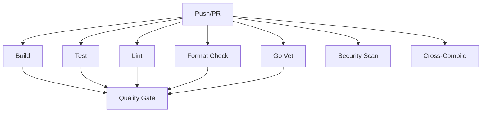

# CI/CD Pipeline Documentation

## Overview

Ship Shape uses GitHub Actions for continuous integration and deployment. The CI/CD pipeline automatically runs on every push to `main` and on all pull requests, ensuring code quality, security, and compatibility across multiple platforms.

## Pipeline Architecture

The CI/CD pipeline consists of 8 jobs that run in parallel where possible:



### Job Descriptions

| Job | Purpose | Duration | Blocking |
|-----|---------|----------|----------|
| **Build** | Multi-version Go build (1.21, 1.22, 1.23) | ~2-3 min | Yes |
| **Test** | Unit tests with coverage reporting | ~1-2 min | Yes |
| **Lint** | Code quality checks (golangci-lint) | ~2-3 min | Yes |
| **Format** | Code formatting validation (gofmt) | ~1 min | Yes |
| **Vet** | Static analysis (go vet) | ~1 min | Yes |
| **Security** | Security vulnerability scanning (gosec) | ~1-2 min | No |
| **Cross-Compile** | Build for 5 platforms | ~3-5 min | No |
| **Quality Gate** | Coverage threshold enforcement | ~1 min | Yes |

## Local Testing

Before pushing code, run all checks locally to catch issues early and save CI time.

### Prerequisites

Install required tools:

```bash
# Go toolchain
go version  # Should be 1.21 or higher

# golangci-lint
brew install golangci-lint  # macOS
# OR
go install github.com/golangci/golangci-lint/cmd/golangci-lint@latest

# actionlint (for workflow validation)
brew install actionlint  # macOS
# OR
go install github.com/rhysd/actionlint/cmd/actionlint@latest

# gosec (optional, for security scanning)
go install github.com/securego/gosec/v2/cmd/gosec@latest
```

### Running Local Checks

Use the Makefile targets to run checks:

```bash
# Run all checks (recommended before pushing)
make check

# Individual checks
make build      # Build the binary
make test       # Run unit tests
make coverage   # Generate coverage report
make lint       # Run golangci-lint
make fmt        # Format code
make vet        # Run go vet
make security   # Run gosec security scan

# Clean build artifacts
make clean
```

### Validating GitHub Actions Workflows

Use `actionlint` to validate workflow files before pushing:

```bash
# Validate all workflows
actionlint

# Validate specific workflow
actionlint .github/workflows/ci.yml

# Auto-fix some issues (use with caution)
actionlint -format '{{range $err := .}}{{$err.Message}}\n{{end}}'
```

Common actionlint checks:
- Valid YAML syntax
- Valid job/step structure
- Proper use of expressions `${{ }}`
- Valid action versions
- Required permissions
- Shell script issues

### Pre-Commit Hook (Recommended)

Create `.git/hooks/pre-commit` to run checks automatically:

```bash
#!/bin/bash
set -e

echo "Running pre-commit checks..."

# Format code
make fmt

# Run linters
make lint

# Run tests
make test

echo "✅ All pre-commit checks passed!"
```

Make it executable:

```bash
chmod +x .git/hooks/pre-commit
```

## Quality Standards

### Code Coverage

- **Current Threshold**: 0% (baseline during initial development)
- **Target Threshold**: 90% for v1.0.0 release
- **Integration Tests**: 80% target

Coverage reports are:
- Generated on every test run: `coverage.out`, `coverage.html`
- Uploaded to Codecov on CI runs
- Enforced by quality gate job

View coverage locally:

```bash
# Generate coverage report
make coverage

# Open HTML report in browser
open coverage.html  # macOS
xdg-open coverage.html  # Linux
```

### Linting Rules

golangci-lint runs 30+ linters. Key configurations:

| Linter | Threshold | Purpose |
|--------|-----------|---------|
| gocyclo | 15 | Cyclomatic complexity |
| gocognit | 20 | Cognitive complexity |
| dupl | 100 | Code duplication |
| goconst | 3 occurrences | Repeated strings |
| nestif | 4 | Nested if depth |

See [.golangci.yml](../../.golangci.yml) for complete configuration.

### Security Scanning

Gosec scans for common security vulnerabilities:
- SQL injection
- Command injection
- Path traversal
- Unsafe cryptography
- Hardcoded credentials
- Race conditions

Results are uploaded as SARIF format to GitHub Security tab.

## Multi-Version Testing

Ship Shape is tested against three Go versions:

- **Go 1.21**: Minimum supported version
- **Go 1.22**: Recommended version
- **Go 1.23**: Latest stable version

This ensures compatibility across enterprise environments and modern toolchains.

## Cross-Platform Support

Binaries are built for:

| OS | Architecture |
|----|--------------|
| Linux | amd64 |
| Linux | arm64 |
| macOS | amd64 (Intel) |
| macOS | arm64 (Apple Silicon) |
| Windows | amd64 |

Cross-compiled binaries are uploaded as artifacts on each CI run.

## Dependency Management

### Dependabot Configuration

Automated dependency updates run weekly:

- **Go modules**: Monday 09:00 (weekly)
- **GitHub Actions**: Monday 09:00 (weekly)

Dependabot PRs:
- Include changelog and compatibility notes
- Run full CI pipeline before merge
- Use conventional commit format
- Auto-assigned to `@chambridge`

### Updating Dependencies

Manually update dependencies:

```bash
# Update all dependencies
go get -u ./...
go mod tidy

# Update specific dependency
go get -u github.com/spf13/cobra@latest

# Verify dependencies
go mod verify
```

## Troubleshooting

### Common CI Failures

#### Linting Errors

**Problem**: `golangci-lint` reports errors not seen locally

**Solution**:
```bash
# Ensure you're using the same version as CI
golangci-lint --version

# Run with same config as CI
golangci-lint run --timeout=5m

# Auto-fix some issues
golangci-lint run --fix
```

**macOS-Specific Issue**: If golangci-lint hangs or is killed immediately on macOS, this is a known Gatekeeper/code signing issue. Workarounds:
- Rely on CI for linting (recommended)
- Use individual tools: `go vet`, `go fmt`, `staticcheck`
- Run via Docker: `docker run --rm -v $(pwd):/app -w /app golangci/golangci-lint:latest golangci-lint run`

#### Format Check Failures

**Problem**: "Code is not formatted" error

**Solution**:
```bash
# Format all code
make fmt

# Verify no changes
git status --porcelain

# Commit formatting changes
git add .
git commit -s -m "style: format code with gofmt"
```

#### Coverage Threshold Failures

**Problem**: Coverage below threshold

**Solution**:
```bash
# Identify untested code
go test -coverprofile=coverage.out ./...
go tool cover -html=coverage.out

# Add tests for uncovered code
# See docs/v1.0.0/test-strategy.md
```

#### Security Scan Issues

**Problem**: Gosec reports vulnerabilities

**Solution**:
```bash
# Run gosec locally
gosec ./...

# See specific issue details
gosec -fmt=json ./... | jq

# Suppress false positives (use sparingly)
# Add #nosec comment with justification
```

### Debugging Workflow Issues

View workflow logs:

```bash
# Using GitHub CLI
gh run list
gh run view <run-id>
gh run view <run-id> --log

# In browser
# Navigate to: https://github.com/chambridge/ship-shape/actions
```

Re-run failed workflows:

```bash
# Re-run failed jobs
gh run rerun <run-id> --failed

# Re-run entire workflow
gh run rerun <run-id>
```

## Performance Optimization

### Caching Strategy

The pipeline uses Go module caching:

```yaml
- uses: actions/setup-go@v5
  with:
    go-version: '1.23'
    cache: true  # Enables automatic module caching
```

This reduces dependency download time from ~2 minutes to ~10 seconds on subsequent runs.

### Parallel Execution

Jobs run in parallel where possible:
- Build, Test, Lint, Format, Vet, Security, Cross-Compile run concurrently
- Quality Gate waits for: Build, Test, Lint, Format, Vet

Total pipeline time: ~3-5 minutes (parallel) vs ~15-20 minutes (sequential)

## Release Process

Release builds are triggered by version tags:

```bash
# Create release tag
git tag -a v1.0.0 -m "Release v1.0.0"
git push origin v1.0.0
```

Release workflow (future):
- Runs full CI pipeline
- Builds release binaries for all platforms
- Generates changelog
- Creates GitHub release
- Uploads binaries as release assets

## Configuration Files

| File | Purpose |
|------|---------|
| [.github/workflows/ci.yml](../../.github/workflows/ci.yml) | Main CI pipeline |
| [.golangci.yml](../../.golangci.yml) | Linter configuration |
| [.github/dependabot.yml](../../.github/dependabot.yml) | Dependency updates |
| [Makefile](../../Makefile) | Local development tasks |

## References

- [GitHub Actions Documentation](https://docs.github.com/en/actions)
- [golangci-lint Documentation](https://golangci-lint.run/)
- [Gosec Security Scanner](https://github.com/securego/gosec)
- [Codecov Documentation](https://docs.codecov.com/)
- [actionlint Documentation](https://github.com/rhysd/actionlint)
- [Dependabot Configuration](https://docs.github.com/en/code-security/dependabot)

## Future Enhancements

Planned improvements:

- [ ] Automated release workflow
- [ ] Performance benchmarking job
- [ ] Integration test suite
- [ ] Docker image building
- [ ] Artifact signing
- [ ] Automated changelog generation
- [ ] Nightly builds against development dependencies
